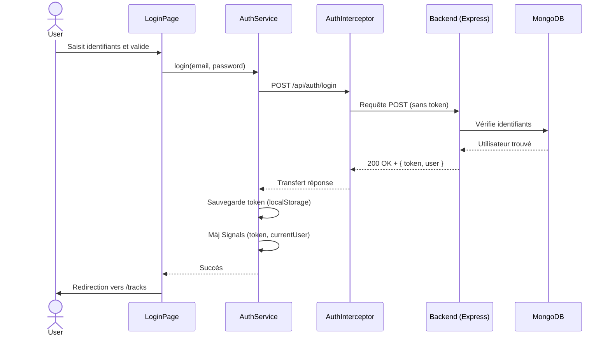
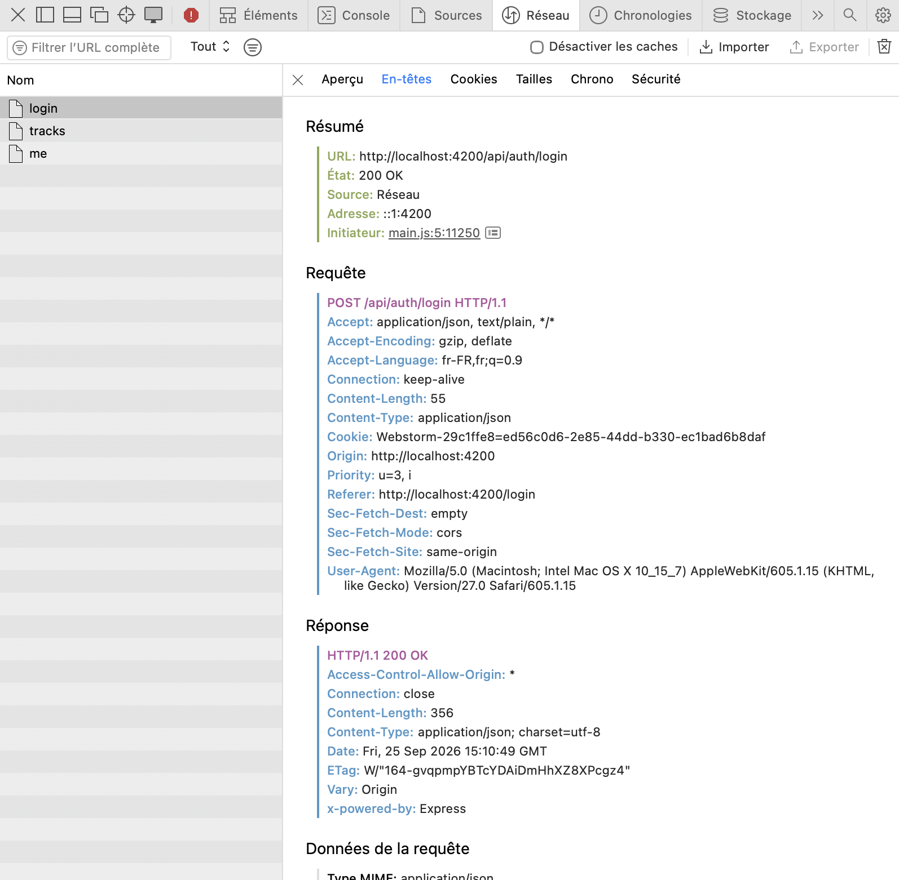
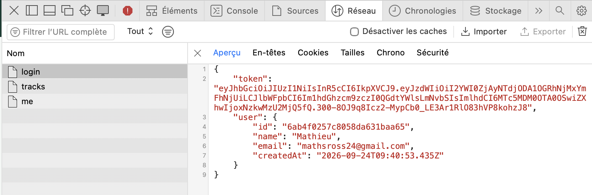

# Rapport d'usage de l'IA - TP1

Pour chaque mission, détailler et fournir des explications concernant : objectif; prompt principal; plan proposé par l'agent; vérifications réalisées par le binôme; erreurs ou propositions rejetées; fichiers effectivement modifiés; preuve de fonctionnement; ce que chaque membre sait maintenant expliquer sans l'agent.

---

## Interaction 1 - Cartographie de l'application (Mission 0)

**Objectif** : comprendre l'architecture globale du projet (front + back) sans toucher au code.

**Prompt** :
> J'ai un projet Angular + Express/Mongo, explique moi l'architecture du projet en place (backend comme frontend). Tu peux te baser sur ce qui est décrit dans la mission 0 du fichier SUJET_ETUDIANT_TP1.md. Fournis également un diagramme de séquence / flux explicatif.

**Réponse de l'IA** : l'agent a parcouru les fichiers du projet et a résumé :
- `main.ts` -> bootstrap de l'app
- `routes.ts` -> les 5 routes, dont 2 protégées par `authGuard` (`/profile`, `/tracks`)
- `auth.service.ts` -> gestion de l'authentification, Signals `token` et `currentUser`, méthodes du logout
- `auth.interceptor.ts` → ajout du `Authorization: Bearer <token>` aux requêtes si un token existe
- `app.js` (backend) → middleware `auth`, routes Express, Multer pour les uploads
- etc.

L'IA a aussi fourni le diagramme de séquence du flux de connexion :

**Tableau routes publiques et protégées** :

| Méthode | Route | Protégée ? |
|---|---|---|
| `POST` | `/api/auth/register` | Non |
| `POST` | `/api/auth/login` | Non |
| `GET` | `/api/users/me` | Oui (JWT) |
| `PUT` | `/api/users/me` | Oui (JWT) |
| `GET` | `/api/tracks` | Oui (JWT) |
| `POST` | `/api/tracks` | Oui (JWT) |
| `GET` | `/api/tracks/:id/audio` | Oui (JWT) |

**Fichiers modifiés** : aucun.

---

## Interaction 2 - Question : pourquoi un intercepteur ?

**Prompt** :
> Je comprends pas bien le rôle de l'intercepteur. Pourquoi on peut pas juste ajouter le header Authorization dans chaque appel du service directement ?

**Résumé** : l'IA a expliqué que sans intercepteur il faudrait répéter le header dans chaque méthode de chaque service (DRY). Il centralise ça = un seul fichier à modifier si le format du token change. Et l'intercepteur peut aussi intercepter les réponses (donc utile plus tard pour le 401).

**Fichiers modifiés** : aucun. C'était juste pour comprendre.

---

## Interaction 3 - Templates de validation (Mission 1)

**Objectif** : avoir les messages d'erreur par champ sur les formulaires login et register.

**Prompt** :
> Début de la mission 1 -> j'ai commencé à modifier les formulaires login et register pour ajouter les validations. Le TS est fait, maintenant fait les templates Angular (+css) pour les messages d'erreur etc.

**Ce que l'IA a fait** :
- Écrit les templates HTML avec les conditions
- Ajouté un état `loading` sur les boutons de soumission (Connexion/Inscription)
- Ajouté un `placeholder` sur les champs pour guider l'utilisateur

**Vérification** : j'ai vérifié tous les messages d'erreur par champ.

**Fichiers modifiés** : `login-page.html`, `register-page.html`.

---

## Interaction 4 - Question sur le Signal

**Prompt** :
> Pour la mission 1, il est demandé "mise à jour du Signal currentUser", c'est quoi ? comment procéder ? et pourquoi c'est mieux ?

**Résumé** : l'IA a expliqué la différence entre le localStorage qui persiste les données entre sessions, et le Signal qui est réactif mais perdu au refresh. Donc on a besoin des deux pour gérer l'état de l'utilisateur connecté.

Dans `AuthService`, la méthode `storeAuthentication()` fait les deux en même temps.

**Ce qu'on sait maintenant expliquer** : pourquoi `readonly token = signal<string | null>(localStorage.getItem('gpc_token'))` au démarrage -> on initialise le Signal avec ce qui a été persisté, pour restaurer la session après un refresh.

**Fichiers modifiés** : aucun (mode ask, modification à la main).

---

## Interaction 5 - Gestion du 401 dans l'intercepteur (Mission 1)

**Objectif** : quand le backend renvoie 401 (token invalide/expiré), nettoyer la session et revenir au login automatiquement.

**Prompt** :
> Ajoute la gestion des erreurs 401 dans l'intercepteur : si le backend répond 401 sur une route protégée, appeler logout() et rediriger vers /login.

**Ce que l'IA a modifié** : ajout d'un `catchError` dans le pipe de l'intercepteur qui vérifie `error.status === 401 && token`, puis appelle `auth.logout()` et route vers `/login')`.

**Fichiers modifiés** : `auth.interceptor.ts`.

---

## Interaction 6 - Debug token expiré au démarrage

**Prompt** :
> Quand j'ouvre l'app, avant même de me connecter, la devTool du navigateur affiche un "jwt expired" et une erreur 401 sur /api/tracks. Pourquoi ?

**Diagnostic de l'IA** : au démarrage, `AuthService` charge le token depuis `localStorage` même s'il est expiré -> le `authGuard` voit un token non-null et laisse passer -> la page tracks fait un `GET /api/tracks` avec le vieux token = 401.

**Solution proposée** : décoder le payload du JWT côté client et vérifier le champ `exp` avant de charger le token. Si expiré -> supprimer de localStorage et démarrer le Signal à `null`.

**Vérification** : après le fix, ouvrir l'app avec un token expiré en localStorage.

**Fichiers modifiés** : `auth.service.ts` (ajout de la méthode `savedToken()`).

---

## Réponses aux questions du sujet

**Quel modèle IA ?** Gemini 3.8 Flash pour la mission 0 via Google Antigravity (car modèle pas cher), et un peu de Opus 4.6 pour le mode agent.

**Consommation de tokens ?** Visible dans l'interface de Antigravity.

**Meilleur modèle pour quelle tâche ?** Modèle léger (Flash) pour les questions rapides et la recherche. Modèle lourd (Opus, Sonnet) pour le refactor et le debug.

**Où s'effectue la mise à jour du profil ?**
- Front : `ProfilePageComponent.save()` -> `AuthService.update(name)` -> `HttpClient.put('/api/users/me', { name })`: le token est ajouté automatiquement par l'intercepteur
- Back : `app.js` (route `PUT /api/users/me`) -> middleware `auth` vérifie le JWT -> `User.findByIdAndUpdate()` -> réponse 200

**Signal vs localStorage ?** Le Signal est réactif (le template se met à jour automatiquement quand la valeur change). Le localStorage persiste entre les sessions dans le navigateur, c'est simplement un stockage clé/valeur. Donc on utilise Signale pour le refresh reactif, et localStorage pour la persistance local du token.

---

## Preuves et Captures (Livrables)

### Capture Network d'une requête d'authentification

Voici la capture d'écran montrant la requête de connexion (`POST /api/auth/login`) réussie dans l'onglet Network du DevTools. 
On retrouve le code de statut 200 et la réponse du serveur avec le token JWT.

